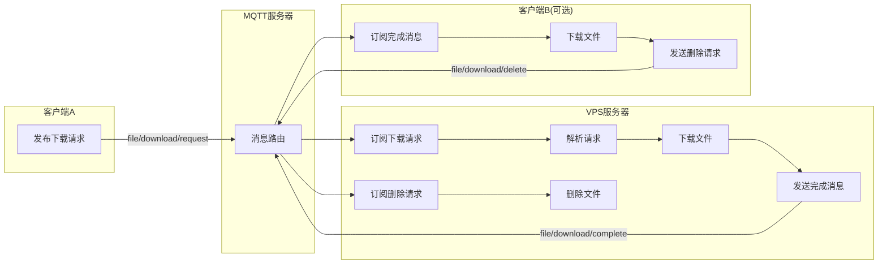

# 云端文件下载器

## 介绍
本项目是基于 MQTT 的云端文件下载器。

## 先决条件
1. 安装 [`uv`](https://github.com/astral-sh/uv)。 
    ```bash
    # On macOS and Linux.
    curl -LsSf https://astral.sh/uv/install.sh | sh
    ```
2. 安装 [`vsd`](https://github.com/forkdo/vsd) 和 [`ffmpeg`](https://ffmpeg.org/download.html)   
3. 安装 [`aria2c`](https://github.com/aria2/aria2)。

## 安装

1. 拉取代码并进入项目目录：
   ```bash
   git clone <repository-url>
   cd file-downloader
   ```
2. 安装依赖：
   ```bash
   uv sync
   ```
   
## 使用

### 基于源码部署
1. 启动 MQTT 服务器
    > EMQX 配置客户端认证功能：访问控制 -> 客户端认证 -> 创建 -> Password-Based -> 内置数据库 -> 键入“用户名、密码” -> 保存。
2. 启动本服务
    ```bash
    uv sync
    uv run fetcher
    ```
3. 使用客户端，发布消息（`JSON`）到主题 `file/download/request`，格式如下：   
建议 `QOS` 为 `0`, `retain` 为 `false`。若 `retain` 为 `true`，则消息会被保留，直到有新的消息发布到相同的主题。会导致重启服务器后，重复下载相同的文件。
    ```bash
    {
      "url": "https://test.com/50941.m3u8",
      "name": "testtest",
      "overwrite": 1
    }
    ```
    若忽略 `name`，则会生成随机文件名。
    若忽略 `overwrite`，则会覆盖同名文件（仅支持**M3U8**）。

4. 等待下载完成
下载完成后，会发布消息到主题 `file/download/complete`，格式如下：
    ```json
    {
      "status": "success",
      "url": "https://test.com/wmfx.m3u8",
      "name": "",
      "file_path": "file_1749464069.mp4",
      "download_url": "http://127.0.0.1:3000/file_1749464069.mp4",
      "timestamp": 1749464116
    }
    ```

5. 删除云端文件（可选）
当 puller 下载成功后，会发布删除请求到主题 `file/download/delete`，fetcher 接收后删除服务器上的文件。可通过 `puller.delete_remote_file` 配置项控制是否启用。
    ```json
    {
      "file_path": "file_1749464069.mp4",
      "name": "",
      "timestamp": 1749464116
    }
    ```

5. 同步下载到本地客户端   
  当服务器端下载 M3U8 视频，且合并为 MP4 视频后，本地客户端同步下载至本地。
    ```bash
    uv sync
    uv run puller    
    ```

### 基于 Docker 部署

- 自构建
    ```bash
     # 构建 
     docker buildx bake
    ```

    **服务端**
    ```bash
     # 运行
     docker run -d -v $(pwd)/downloads:/app/downloads --name file-downloader file-downloader:local

     # 使用环境变量
     docker run -d -v $(pwd)/downloads:/app/downloads -e DOWNLOAD_WEB_URL="http://127.0.0.1:8080/" --name file-downloader file-downloader:local
    ```

    **客户端**
    ```bash
     # 使用外置的 aria2 下载视频
     docker run -e ARIA2_RPC_HOST=http://192.168.1.138 -e ARIA2_DOWNLOAD_DIR=test_down -it file-downloader:local puller --qos 2 --aria2-rpc-token your-secret-key --aria2-rpc-enable 1 --aria2-rpc-download-dir test_download
    
     # 挂载下载目录
     docker run -e ARIA2_DOWNLOAD_DIR=test_down -e QOS=2 -v $(pwd)/aria2down:/app/test_down -it file-downloader:local puller

     # aria2c rpc server
     aria2c --enable-rpc --rpc-listen-all=true --rpc-secret=your-secret-key --dir=/downloads
    ```

- 基于 Docker Compose
使用 [**`Docker Compose`**](docker/README.md) 部署，请查阅 `docker/README.md`。

- 使用项目提供的 Docker 镜像

    > **版本：** `latest`, `main`, <`TAG`>

    | Registry                                                                                   | Image                                                  |
    | ------------------------------------------------------------------------------------------ | ------------------------------------------------------ |
    | [**Docker Hub**](https://hub.docker.com/r/idevsig/file-downloader/)                                | `idevsig/file-downloader`                                    |
    | [**GitHub Container Registry**](https://github.com/idev-sig/file-downloader/pkgs/container/file-downloader) | `ghcr.io/idevsig/file-downloader`                            |
    | **Tencent Cloud Container Registry**                                                       | `ccr.ccs.tencentyun.com/idevsig/file-downloader`             |
    | **Aliyun Container Registry**                                                              | `registry.cn-guangzhou.aliyuncs.com/idevsig/file-downloader` |

## 配置

配置可以通过（按优先级增加的顺序）设置：
1. 环境变量
2. 项目根目录下的配置文件 `config.toml` 
3. 命令行参数

配置文件 `config.toml`:
```toml
[mqtt]
broker = "test.mosquitto.org"
port = 1883
username = ""
password = ""
qos = 2
keepalive = 60
client_id = "file"

topic_subscribe = "file/download/request"
topic_publish = "file/download/complete"

[aria2]
rpc_enable = 1 # 是否启用 Aria2 RPC 服务
rpc_host = "http://localhost"
rpc_port = 6800
rpc_token = "your-secret-key"
download_dir = "aria_downloads"

[download]
# 下载文件保存目录
save_dir = "downloads"
# 下载文件 Web URL
web_url = ""

[puller]
# 是否删除云端文件（下载成功后通知 fetcher 删除）
delete_remote_file = 0
# 下载超时时间（秒），默认 3600（1小时）
download_timeout = 3600
```

- **download.web_url（环境变量 DOWNLOAD_WEB_URL）** 用于替换下载文件的 URL 前缀。
比如文件名为 `test.mp4`，如果配置了此参数值为 `http://127.0.0.1:8080/downloads/`，则下载此 MP4 视频的网址为：`http://127.0.0.1:8080/downloads/test.mp4`。配合 `nginx` 反向代理使用。

- **puller.delete_remote_file（环境变量 DELETE_REMOTE_FILE）** 控制 puller 下载完成后是否通知 fetcher 删除云端文件。设为 `1` 启用删除，设为 `0`（默认）禁用。

- **puller.download_timeout（环境变量 DOWNLOAD_TIMEOUT）** 设置下载超时时间（秒）。默认 `3600`（1小时）。超时后下载任务将被取消。

命令行参数:
```bash
uv run puller --delete-remote-file 1 --download-timeout 7200
```
```bash
uv run fetcher --broker test.mosquitto.org --port 1883
```

## 运行

```bash
uv run fetcher
```



## 仓库镜像

[MyCode](https://git.jetsung.com/idev/file-downloader) ● [AtomGit](https://atomgit.com/idev/file-downloader) ● [GitHub](https://github.com/idevsig/file-downloader)
